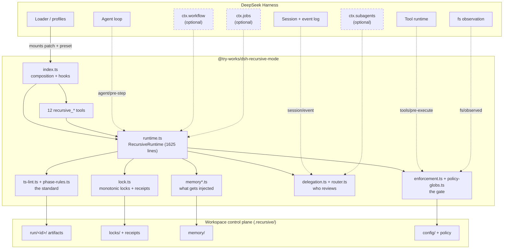
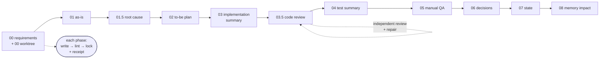
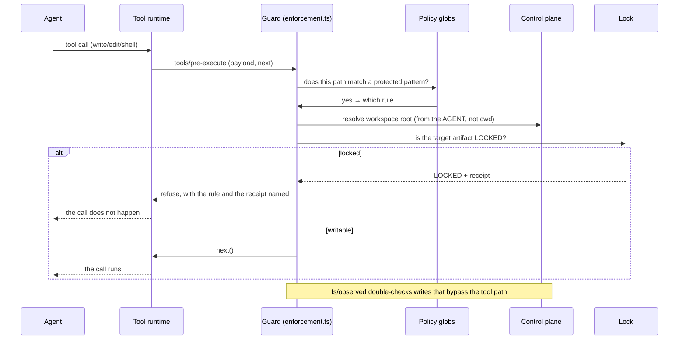
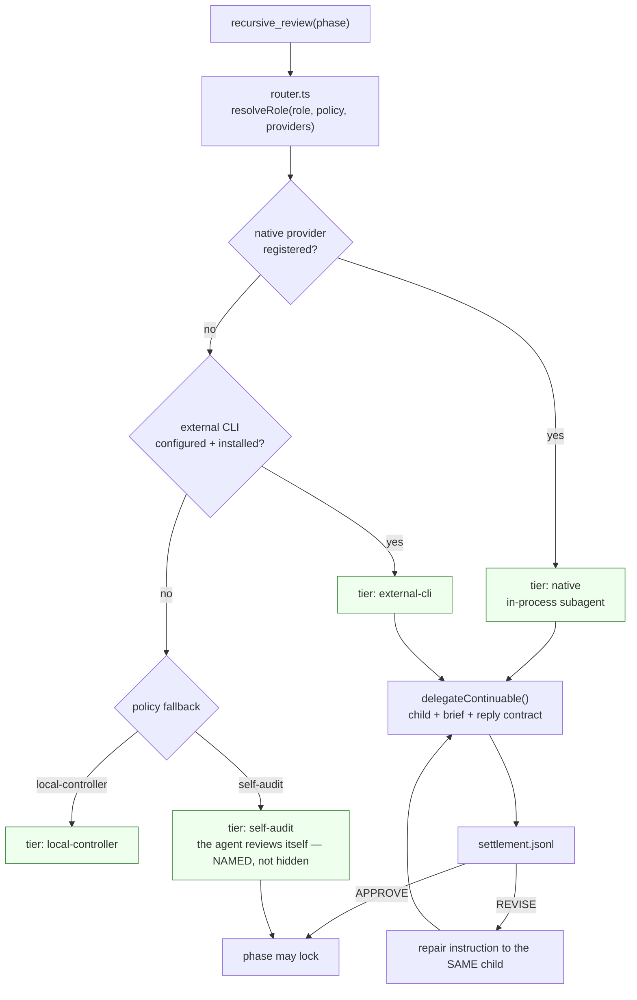
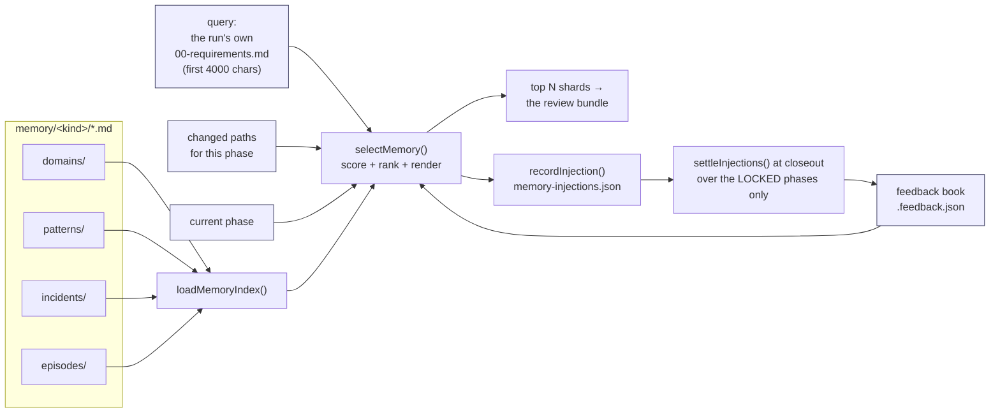
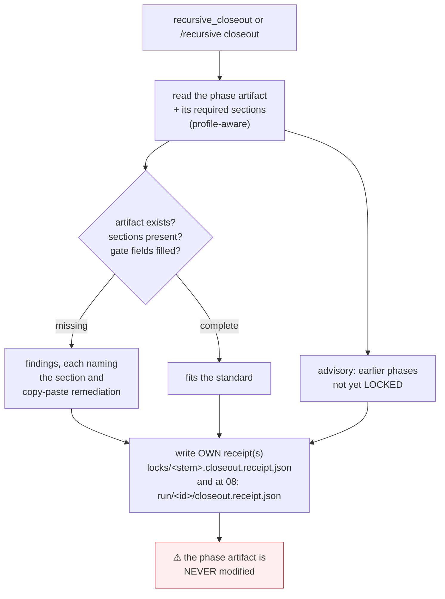
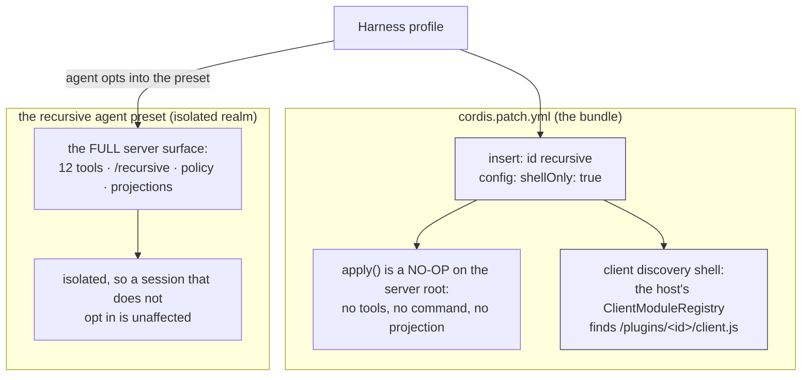

# dsh-recursive-mode

**A 12-phase, evidence-gated workflow for coding agents — implemented as a DeepSeek Harness plugin.**

`@try-works/dsh-recursive-mode` turns "an agent wrote some code" into a **run** with a shape: requirements before
plans, plans before code, independent review before a lock, tests before a claim, and a receipt for every phase
that says who locked it and on what evidence. The discipline lives in the harness, not in a prompt, so it cannot
be skipped by an agent that is in a hurry.

- **12 tools** on the agent surface, one slash command, a workspace control plane, and a memory plane that
  learns from what actually got used.
- **Zero runtime dependencies** beyond the harness itself — everything is a structural seam.
- **862 tests across 91 files**, three parity specs against the reference implementation, a live-session
  harness, and a fresh-clone check that runs unattended.

> **Honest status, up front.** One capability in this repository is **implemented but NOT VERIFIED live**: the
> continuable review's repair leg (a child reviewer that receives a repair instruction for the same child). Its
> remaining blocker is in the host, not here, and is documented in [DSH-LIMITATIONS.md](DSH-LIMITATIONS.md)
> entries 9 and 10. Everything else described below was verified against a running harness. Where a claim in this
> document rests on a specific measurement, the measurement is named.

---

## Contents

1. [Background: why this exists](#1-background-why-this-exists)
2. [Purpose and design principles](#2-purpose-and-design-principles)
3. [Architecture](#3-architecture)
4. [Capabilities](#4-capabilities)
5. [How a run works, phase by phase](#5-how-a-run-works-phase-by-phase)
6. [How it works: the control plane](#6-how-it-works-the-control-plane)
7. [How it works: the guard](#7-how-it-works-the-guard)
8. [How it works: delegation and review](#8-how-it-works-delegation-and-review)
9. [How it works: the memory plane](#9-how-it-works-the-memory-plane)
10. [How it works: closeout as a linter](#10-how-it-works-closeout-as-a-linter)
11. [How it works: mounting and the preset](#11-how-it-works-mounting-and-the-preset)
12. [Getting started](#12-getting-started)
13. [Verification: what is proven, and how](#13-verification-what-is-proven-and-how)
14. [File map and further reading](#14-file-map-and-further-reading)

---

## 1. Background: why this exists

An agent with a shell and a test runner can produce working code. What it cannot reliably produce on its own is
**the record of how it knows**. Ask it afterwards why a decision was made, what it checked, what it could not
check, and which of its claims were verified, and you get a reconstruction — prose written after the fact, in
whatever shape the model happened to prefer that day.

**recursive-mode** is the answer to that: a workflow that makes the *evidence* a first-class artifact, produced
**before** the lock rather than after the question.

Three ideas do the work:

**Phases are ordered and monotonic.** Twelve artifacts, from `00-requirements.md` to `08-memory-impact.md`. Each
one locks, and a lock is one-way: an earlier phase cannot be rewritten after a later one exists. A run therefore
has a **history**, not a current state.

**Every claim has a container.** Phase artifacts have required sections — checked by a linter, not by a model's
judgement. A test summary has an "Execution Mode" and "Commands Executed (Exact)". A code review has an "Audit
Verdict". If the container is empty, the phase does not lock.

**Verification is independent.** The reviewer is not the author. Where a subagent is available, the review runs
on a child with its own context; where it is not, the fallback is **named** rather than hidden, so a self-audit
is never mistaken for an independent one.

The name is literal: the workflow applies to its own development. This plugin is built under itself — its own
control plane lives in `.recursive/` in this repository, and its own tracker
([STRENGTHENING-PLAN.md](STRENGTHENING-PLAN.md)) records every defect it has found in its own behaviour.

---

## 2. Purpose and design principles

**Purpose.** Give a coding agent a workflow it can be *held to*: ordered phases, evidence gates, independent
review, a durable record — enforceable by the host on every tool call, and inspectable by a human afterwards
without asking the agent anything.

Five principles, each of which cost real defects to learn:

| Principle | What it means in code | Why |
|---|---|---|
| **The linter owns the standard** | Required sections live in `phase-rules.ts` and are enforced by `ts-lint.ts` (2175 lines) | A standard a model can restate is a standard a model can drift from |
| **The guard is a gate, not advice** | `tools/pre-execute` refuses writes to locked artifacts | A rule that is only in the prompt is a rule that holds until it is inconvenient |
| **Fail closed** | An unreadable verdict is a REVISE, never an APPROVE | The failure mode of "assume good" is an approval nobody gave |
| **Fail loud, and name the cause** | Every fallback reports *which* condition fired | Nine separate defects in this codebase were surfaces that said less than the code knew |
| **Structural seams, no hard dependencies** | Every host service is an optional interface resolved at composition | The plugin must load on a host that mounts none of them |

The fourth principle is the one this project learned the hard way. A representative example, from
[DSH-LIMITATIONS.md](DSH-LIMITATIONS.md): a fallback message that read *"no continuable seam or no live parent"*
covered **three** distinct conditions, so a live failure could not be diagnosed from its own report — three
rounds of experimentation went into a sentence that could have named the cause outright.

---

## 3. Architecture



**Reading the diagram.** The four dashed lines into the plugin are the harness's own extension points — the
plugin does not poll and does not own a loop; it is *called* at four moments (a tool about to run, a file
observed, a session event committed, a step about to start). The three dashed services on the right are
**optional**: the plugin resolves each at composition and degrades with a *named* reason when one is absent. The
control plane on disk is the only state it trusts across restarts.

---

## 4. Capabilities

### 4.1 The twelve tools

| Tool | What it does |
|---|---|
| `recursive_status` | Where the run is: phases, lock states, gates, next action |
| `recursive_init` | Scaffold a run and a workspace (templates, profile, memory skeleton) |
| `recursive_lock` | Lock a phase — refuses if the artifact does not meet the standard |
| `recursive_lint` | Lint a run or an artifact against the phase standard, with remediation text |
| `recursive_closeout` | Report what a phase artifact is missing; **writes a receipt, never the artifact** |
| `recursive_phase` | Read the phase graph: what is required, what is next, what is blocked |
| `recursive_worktree` | Create/promote a git worktree for a run, so work is isolated |
| `recursive_scratch` | The child's scratch space: durable, per-run working notes |
| `recursive_review` | **Independent review** of the phase artifact, with a repair path |
| `recursive_audit_team` | Fan a phase out across roles (audit) |
| `recursive_ask` | Ask the workspace a question, with the control plane as context |
| `recursive_preview` | Preview what a tool would do, without doing it |

### 4.2 The command surface

One slash command, `/recursive <verb>`, usable with **no agent loop** — the verbs run the workspace's own code:

```
/recursive status | spec | init | lock | qa | closeout | addendum | review | scratch | worktree | memory
/recursive bootstrap | list | help          (global verbs)
```

`memory` is the newest and is a good example of the design: it runs the *same* scorer the agent's context
injection uses, and prints the **score components** for every candidate — so "why did the agent get this
context?" is answerable without starting an agent:

```
$ /recursive memory lock chain ordering --phase 04
```

### 4.3 Beyond the tools

- **A guard** that refuses writes to locked artifacts, including through the shell (`policy-globs.ts`, 636 lines
  of pattern analysis).
- **A memory plane** with relevance scoring, phase applicability, and a feedback loop that learns from what was
  actually injected.
- **A delegation layer** that routes a review to a native subagent, an external CLI, a self-audit, or a local
  controller — and **always reports which**.
- **A closeout linter** over the whole run (00–08), with per-phase and run-level receipts.
- **A client half** (`platform: web`) so the run's state is visible in the harness UI.
- **A training path** that improves this plugin's own prompts from its own recorded outcomes.

---

## 5. How a run works, phase by phase



Every arrow is enforced: a later artifact may not exist while an earlier one is unlocked, and the guard refuses
writes to a locked one. The phase rules are **profile-aware** — a `feature` run and an `audit` run ask for
different sections — and the required sections for each are read from `getArtifactRequiredSections`, so the
linter and the guard can never disagree about the standard.

**A lock is a receipt, not just a marker.** When a phase locks, a receipt records the artifact's content hash,
the gate status, and the evidence that let it through. This is why a run can be audited months later: the
receipts are the *reasoning trail*, and they are files, not log lines.

**Phase artifacts are never rewritten by the tooling.** Where the phase document lacks a section, the closeout
says so and the **agent** adds it — the plugin's job is to check, not to author. (This was a design decision made
twice: an early version overwrote DRAFT artifacts, and a probe confirmed the agent's content was gone. See
[STRENGTHENING-PLAN.md](STRENGTHENING-PLAN.md), FU-8/FU-12.)

---

## 6. How it works: the control plane

```
.recursive/                                  ← one control plane per workspace
├── AGENTS.md, RECURSIVE.md, STATE.md, DECISIONS.md    ← the agent-facing contract
├── config/
│   ├── recursive-router.json                ← which provider serves which role
│   └── policy (globs, enforcement)          ← what the guard refuses
├── memory/
│   ├── MEMORY.md                            ← the router file
│   ├── domains/ patterns/ incidents/ episodes/ archive/ skills/
│   └── .feedback.json                       ← what was applied vs contradicted
├── memory-injections.json                   ← what context each phase was given
├── run/<run-id>/
│   ├── 00-requirements.md … 08-memory-impact.md       ← the artifacts
│   ├── 0N-*.receipt.json                              ← per-phase lock receipts
│   ├── closeout.receipt.json                          ← the whole-run receipt
│   ├── evidence/review-bundles/                       ← what the reviewer was given
│   └── subagents/
│       ├── <delegation>/child-<id>/{brief.md,reply.md}
│       ├── *-action.md                                ← what the child claims it did
│       └── settlements.jsonl                          ← how each child round ended
└── locks/<stem>.lock                                  ← the monotonic lock itself
```

Two conventions matter more than they look:

**The control plane is found from the agent, not from the process.** `resolveControlPlaneRoot(agent, registry,
repoRoot)` resolves the workspace the *session* is in. A plugin that used `process.cwd()` would silently lint the
wrong repository when the host checkout and the workspace differ.

**The memory plane is read at `<controlPlaneRoot>/memory/<kind>/`.** This was measured, not assumed: a probe
showed `<dir>/memory/domains` is selected, `<dir>/.recursive/memory/...` is not, and using `.recursive` as the
root is selected again. A behaviour test that seeds the wrong path fails *exactly like* a broken implementation,
which is why the distinction is written down here.

---

## 7. How it works: the guard

The guard is the part an agent cannot talk its way past. It runs **before** a tool executes and on every
observed file write.



**Why two hooks.** `tools/pre-execute` covers everything that goes through the tool runtime; `fs/observed` catches
the rest. A shell command that redirects into a locked artifact is the case that motivates the second one.

**Why the refusal names the rule.** A refusal that says only "denied" teaches an agent to try a different route.
A refusal that names the pattern and the lock receipt ends the attempt, and gives a human the same information.

**Enforcement is staged, not binary.** `enforcement.ts` resolves a configuration that can be advisory or strict,
per rule — because a workflow that can only be on or off gets turned off.

---

## 8. How it works: delegation and review

The review is the phase where the workflow earns its name: **the reviewer is a different agent**. Getting the
review to the right provider, and knowing afterwards which one actually ran, is the whole of this subsystem.



**Router.** `resolveRole` tries providers named `[role, 'spawn', 'fork', 'dsh-sdk']` in the provider map and
returns the **native** tier for the first one present; only then does it consider an external CLI and finally the
policy fallback. The provider map is built from the attached subagents service — and if that service cannot
enumerate its providers, the plugin reports the names it *did* see rather than pretending.

**The child gets a contract, in files.** Before any service call, the plugin writes
`subagents/<delegation>/child-<id>/brief.md`, which names the delegation, the artifact, the anti-patterns to look
for, and — critically — the **`Reply file:`** path the child must write and cite. The reply is a file because a
file survives a restart, a compaction, or a crash.

**One child per review, kept across rounds.** A REVISE is delivered as a follow-up to the **same** child, so the
reviewer retains its working set: the repair is checked by the agent that found the problem, not by a fresh one
with no memory of it.

**The settlement is the truth.** A round ends when a settlement lands in `subagents/settlements.jsonl` (captured
from `session/event`, with a cheap shape test first, because that event fires for *every* committed event). The
observer **waits** — bounded, polling, with a timeout — and reports "no settlement yet" only after actually
waiting. The park remains as the fallback, so an unobserved round is never an approval.

**Action records are written for every delegation**, and they carry `Execution Mode` and `Status`. After a
failed delegation, they now also carry **`Failure:`** — because `Status: failed` on its own cannot distinguish a
child that ran and failed from a child that never started. That distinction cost three rounds of investigation
before the field existed.

---

## 9. How it works: the memory plane

Memory here is not a vector store; it is **markdown files with a scorer in front of them**, and the scorer's
inputs are visible.



**Scoring is additive and inspectable.** A shard scores for matching the query, for overlapping the changed
paths (`MEMORY_PATH_MATCH_WEIGHT = 3`), for applying to the current phase (`MEMORY_PHASE_MATCH_WEIGHT = 2`), and
for its feedback history (`feedbackBonus`, clamped to ±1). `explainMemorySelection` returns the **components** per
shard, which is what `/recursive memory` prints — no agent loop, no guessing.

**The explainer and production share the scorer.** A spec asserts that both produce the **same order** for every
option set — including a feedback case, a phase case, and a key that matches nothing. If they ever disagree, the
test fails immediately rather than after someone notices the context is wrong.

**The feedback loop closes at closeout.** Injections are recorded where selection happens
(`memory-injections.json`), and settled at closeout — but **only over phases that actually LOCKED**, because a
shard that was injected into work that never locked taught nobody anything. `settleInjections(root, runDir,
PHASE_SEQUENCE.filter(file => getLockStatus(join(runDir, file)) === 'LOCKED'))` is the whole rule, in one line.

**Feedback is a nudge, never a verdict.** `feedbackBonus` moves a shard by at most ±1, which is deliberately
less than a path or phase match: history should break ties, not overrule relevance.

### The behaviour test that makes the loader matter

The only acceptance test that proves the *loader* (rather than the scorer) is this: run the same workflow twice
in the FU-1 harness, changing **one** shard, and assert the model was told something different. It is
intentionally end-to-end, because a unit test on `selectMemory` cannot prove the selected shards reach a prompt.
It failed twice before it passed, and the cause was the **seeding path**, not the wording — which is exactly the
kind of false conclusion a unit test would have let stand.

---

## 10. How it works: closeout as a linter

Closeout is not a writer. It is a **linter over the run**, plus a receipt:



**Why a linter and not a fixer.** The agent is the author; the tool is the check. An earlier version of this
plugin *did* scaffold missing sections, and a probe showed it overwriting the agent's own content — so a phase
that the agent had written correctly could be silently replaced by a stub. The closeout now reports, and the
agent fills the gap. A **receipt** is written, because a check that leaves no trace is a check nobody can audit.

**The receipt covers the whole run.** `runCloseoutReport` walks `RUN_ARTIFACT_SEQUENCE` (00–08) and reports each
artifact's state — which is why a run can be summarised without reading nine files.

**The command surface agrees with the tool.** `/recursive closeout <run> --phase 04` runs the same report and
prints findings and advisories. It used to return *"closeout scaffolded for …"* while reading nothing and
checking nothing — a command that reported success for work it never did. That defect is why this document
describes the **linter** behaviour as a contract rather than a detail.

---

## 11. How it works: mounting and the preset

The plugin mounts in two halves, and understanding why explains a lot of the file layout.



**Why the split.** Client discovery requires an **enabled bare-name entry** in the loader's profile
(`entry.fiber !== undefined && !entry.disabled`), and preset-mounted subtrees are absent from
`ctx.loader.entries()`. So the bundle contributes a single enabled row whose `apply()` deliberately does nothing
on the server — it exists so the UI half can be discovered. The **full** server surface belongs to the preset,
where it is isolated per session: installing the plugin does not impose the workflow on every agent in the
profile, and opting in does not require editing the host profile by hand.

**Optionality everywhere.** `ctx.get('goals')`, `ctx.get('jobs')`, `ctx.get('subagents')`, `ctx.get('workflow')`
are all resolved at composition and may be `undefined`. Two lessons are encoded in that:

- **`ctx.provide` alone does not reach `ctx.get`** — the value must also be `ctx.set`. The failure is silent:
  the consumer reports its own "not mounted" path, which reads like a configuration choice.
- **A one-shot `ctx.get` at apply time can miss a service mounted by a later layer.** The subagents seam is
  therefore attached through `ctx.inject('subagents', …)`, the harness's own pattern, so the seam arrives
  whenever the service does. A live run proved the cost of relying on the one-shot read.

---

## 12. Getting started

**Requirements.** A DeepSeek Harness checkout (the plugin's peer dependencies are the harness packages) and
Node with pnpm.

```bash
# 1. install (links the harness packages into this checkout)
pnpm install
pnpm link:dsh

# 2. gate the tree
pnpm typecheck && pnpm test && pnpm build

# 3. end-to-end: the plugin under a scripted harness
pnpm e2e

# 4. live session against a real CLI (needs a built harness)
node scripts/live-session-plugin.mjs
```

**Mounting it.** The package declares `dsh.bundle.patch`, so a profile can install it as a bundle; the server
surface arrives when a session opts into the `recursive` preset. See
[`cordis.patch.yml`](cordis.patch.yml) for the shell row and its reasoning.

**First run.**

```
/recursive bootstrap          # scaffold a workspace control plane
/recursive init <run-id>      # create a run (templates + memory skeleton)
# … the agent writes 00-requirements.md …
/recursive lint <run-id>
/recursive lock <run-id> --phase 00
/recursive status <run-id>
```

**Inspect what the agent was told:**

```
/recursive memory <query> --phase 04      # score components per shard
```

---

## 13. Verification: what is proven, and how

| Claim | How it is established |
|---|---|
| The workflow's own rules hold | `pnpm test` — **862 tests, 91 files**, including three **parity specs** (lock, status, lint) against the reference implementation |
| The tree is sound | `pnpm typecheck` (0 errors), `pnpm build` (0) |
| The docs match the code | `docs-contract.spec.ts` — 15 tests asserting documented paths, tools, and sections exist |
| The plugin runs under a real harness | `pnpm e2e` — the FU-1 harness, **10/10**, including the behaviour test where removing one shard changes what the agent is told |
| A fresh checkout works unattended | `git clone` → `pnpm install` → **862/862**, verified in the closing sweep |
| The plugin runs in a real CLI session | `scripts/live-session-plugin.mjs` — headless CLI, temp HOME, scripted LLM; the run reaches the review tool and the control plane is written |
| Memory actually reaches the model | the P5 harness test, end to end |
| The guard refuses locked writes | enforcement specs plus the live probe that found the overwrite defect |
| The workflow engine is reachable | a live `workflow` tool call returned `{ parallel: [42, "phase-hooks-ran"], phasesRan: true }` with `0 agents` |

**Not proven, and stated as such:**

> **The continuable review's repair leg has never completed in a live session.** The child is created, the brief
> and reply contract are written correctly, and the delegation reaches the *native* tier — but the round never
> produces a settlement, and the original error is destroyed inside the host before this plugin can observe it.
> See [DSH-LIMITATIONS.md](DSH-LIMITATIONS.md) entries 9 and 10 for the mechanism and the two one-line fixes
> that would unblock it. It is recorded as NOT VERIFIED in [STRENGTHENING-PLAN.md](STRENGTHENING-PLAN.md) rather
> than described as working.

**How this project verifies its own claims.** Every gate runs **before** a commit, never after. Two changes in
this session were reverted rather than patched onward when they turned the suite red: a settlement-observer
change (its fallout was four specs asserting an immediate park) and a failure-reason field (13 specs pinning the
action-record shape). Both landed later, correctly, once the specs were brought along. The rule is simple: **an
item counts as done when a live run demonstrates the behaviour it claims — otherwise it is reported as
unverified.**

---

## 14. File map and further reading

**Source, by responsibility** (`src/`, ~16k lines):

| Area | Files |
|---|---|
| Composition & runtime | `index.ts`, `runtime.ts`, `config.ts`, `types.ts`, `workspace.ts`, `client.ts` |
| The standard | `phase-rules.ts`, `ts-lint.ts`, `closeout-standards.ts`, `closeout.ts`, `closeout-report.ts`, `phase-graph.ts` |
| Locks & receipts | `lock.ts`, `run.ts`, `snapshot.ts` |
| The guard | `enforcement.ts`, `policy-globs.ts`, `fs-intent.ts`, `guard-log.ts`, `errors.ts` |
| Delegation & review | `delegation.ts`, `router.ts`, `role-route.ts`, `review.ts`, `review-round.ts`, `settlement.ts`, `handoff.ts`, `teams-loop.ts`, `live-route.ts` |
| Memory | `memory.ts`, `memory-select.ts`, `memory-feedback.ts` |
| Surfaces | `recursive_*.tool.ts` (12), `commands.ts`, `hooks.ts`, `status.ts` |
| Infrastructure | `jobs-runner.ts`, `job-log.ts`, `goals-projection.ts`, `lifecycle.ts`, `bootstrap.ts`, `init-templates.ts`, `worktree.ts`, `git-context.ts`, `scratch.ts`, `skills.ts`, `skills-phase.ts`, `training.ts`, `workflow-audit.ts`, `plan-gate.ts`, `result-cap.ts`, `json-safe.ts`, `identity.ts`, `policy.ts` |

**Documents:**

| Document | What it is |
|---|---|
| [WORKFLOW.md](WORKFLOW.md) | The workflow as the agent sees it — phases, gates, profiles |
| [STRENGTHENING-PLAN.md](STRENGTHENING-PLAN.md) | The live tracker: every task (T\*) and follow-up (FU-\*) with evidence |
| [DSH-LIMITATIONS.md](DSH-LIMITATIONS.md) | Ten host limitations found while building this, each with its measurement |
| [TRAINING.md](TRAINING.md) | The training path: improving this plugin's prompts from its own outcomes |
| [IMPLEMENTATION-NOTES.md](IMPLEMENTATION-NOTES.md) | Notes from building it |
| [PROPOSAL.md](PROPOSAL.md), [CHANGELOG.md](CHANGELOG.md) | Origin and history |
| [ADR-event-log-and-durable-queue.md](ADR-event-log-and-durable-queue.md) | Decision record: the event log and durable queue |
| [HANDOFF-review-and-opine.md](HANDOFF-review-and-opine.md) | Handoff notes for the review path |

**Layout:** `preset/` (the agent preset), `skills/` (agent-facing skill), `references/` (templates for the
pointer files a workspace gets), `scripts/` (harness, e2e, live-session, installer), `tests/` (91 spec files).

---

## The one-paragraph version

**dsh-recursive-mode makes an agent's process auditable by making it a file system.** Twelve phases with required
sections, monotonic locks with receipts, a guard that refuses writes to locked artifacts, an independent review
routed to whichever provider is actually available, a memory plane whose scoring is printed on demand, and a
closeout that lints the whole run and writes a receipt instead of touching the agent's work. It is verified by
862 tests, three parity specs against the reference implementation, a live-session harness, and an unattended
fresh-clone check — and it reports the one capability it has not managed to prove live, with the host-side
reason, rather than describing it as working.
