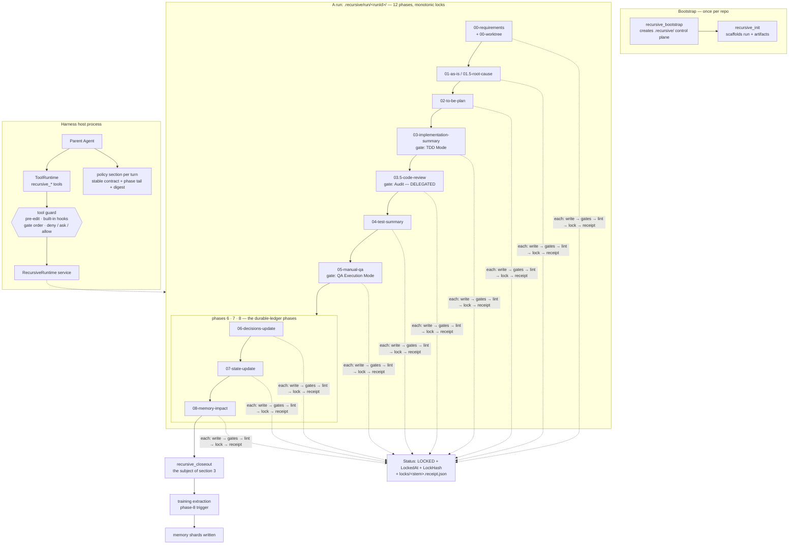
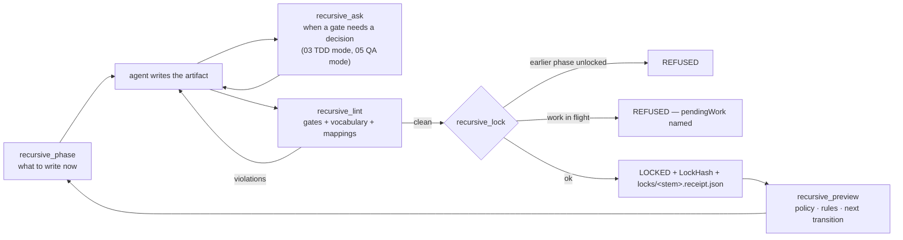
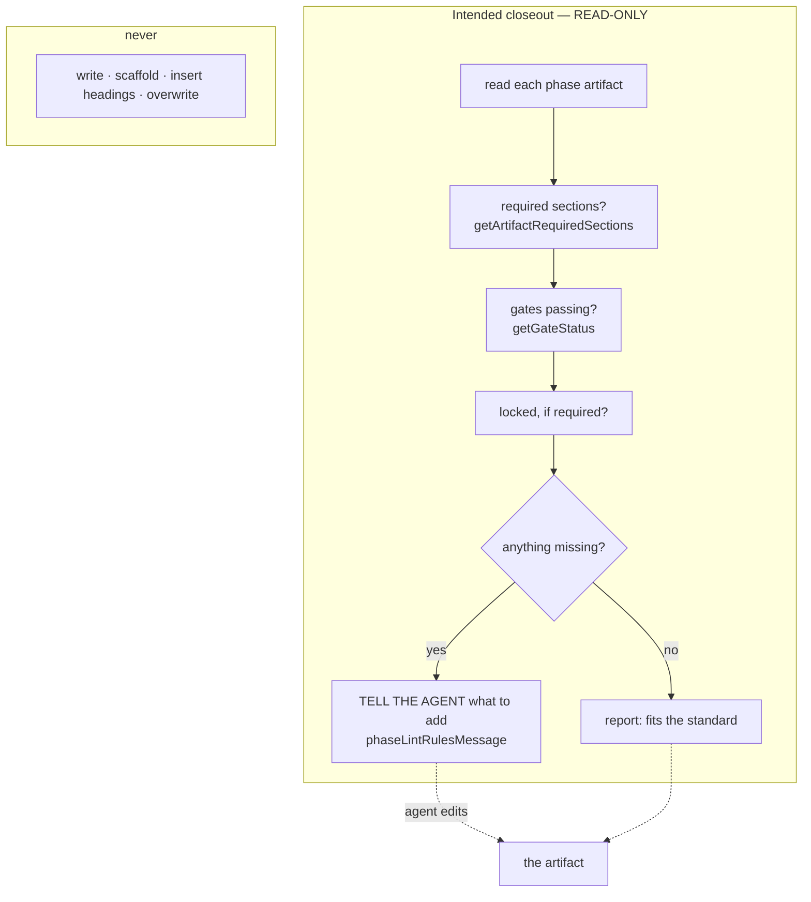
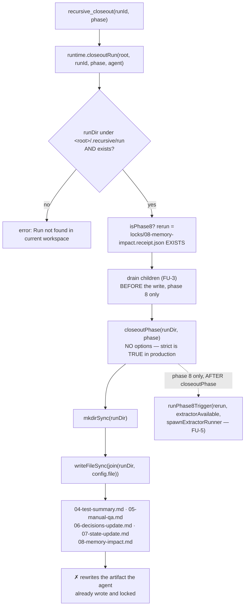
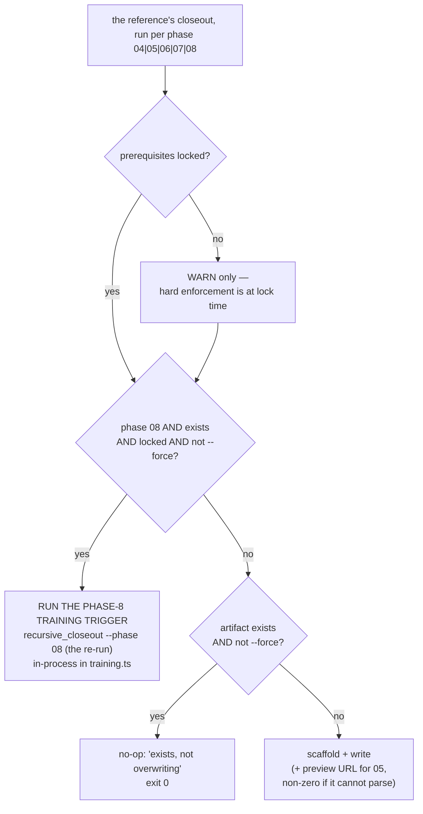
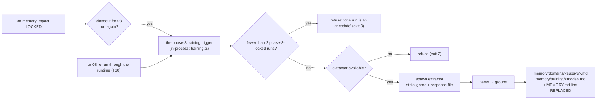

# The recursive-mode workflow — diagram

> Status key used throughout: **[M]** measured this session from source or a live run · **[R]** from the
> reference implementation in `D:\DEV\recursive-mode` · **[D]** the design the user specified · **[!]** a known
> divergence between what the code does and what it should do.

---

## 1 · The whole workflow



## 2 · Every phase transition, mechanically



**[M]** Lock refusals are distinct and named: out-of-order, work-in-flight, and already-locked.

---

## 3 · Phases 6, 7, 8 — and the closeout

### 3a · What 6/7/8 write (the durable records)

**[R]** Each late phase is bound to one control-plane document — the reference declares these as
`extra_inputs` / `extra_outputs` per phase:

| phase | artifact (per run) | **durable record it updates** |
|---|---|---|
| **06** | `06-decisions-update.md` | **`.recursive/DECISIONS.md`** — the decision ledger |
| **07** | `07-state-update.md` | **`.recursive/STATE.md`** — the state ledger |
| **08** | `08-memory-impact.md` | **`.recursive/memory/MEMORY.md`** + **`.recursive/memory/skills/SKILLS.md`** |

**[D]** *"phase 6 7 8 writes the state decisions memory artifacts."* The phase artifact is the run-local
**receipt of the delta**; the ledger is the durable thing that outlives the run. The three are also the
`LATE_PHASE_ARTIFACTS` set in `phase-rules.ts` **[M]**.

### 3b · What the closeout is supposed to be

**[D] — verbatim:** *"closeout.ts is supposed to verify whether the phase artifact docs contain the scaffold
information or not, then tell the agent to add it if not. It is not supposed to just insert section titles
into the docs. It is like a linter checking if the agent missed anything. It is not supposed to edit files by
itself."*



**Where each piece of the standard already lives [M] — no private list is needed:**

| need | existing source |
|---|---|
| the artifact list | `RUN_ARTIFACT_SEQUENCE` (`ts-lint.ts`) |
| required sections | `getArtifactRequiredSections` (`phase-rules.ts`, **profile-aware**) |
| gate expectations | `getGateStatus` / `hasGateLine` (`ts-lint.ts`) |
| guidance to give the agent | `phaseLintRulesMessage` (`phase-rules.ts`) |

### 3c · What the closeout does today **[!]**

> ⚠ **`config.file` IS NOT A CONFIG FILE.** The name misled a reader once, so the path is spelled out here.
> `config` is the `PHASE_CONFIG` entry for the requested phase — `{ file, label, scopeNote, todoItems }` —
> and `config.file` is the **run document's** name (`04-test-summary.md`). The write target is therefore
> `.recursive/run/<runId>/04-test-summary.md`: **the phase artifact itself**, which the agent already wrote
> and locked. It writes nothing to `STATE.md`, `DECISIONS.md` or `memory/**` — those appear only as prose
> *inside the document it overwrites*.



**Measured from `runtime.closeoutRun` (L320-362):**

- A **workspace-scoping guard**: the run must sit under `<root>/.recursive/run`, else
  `Run not found in current workspace`. It never crosses workspaces.
- The **T30 training trigger is already receipt-based and re-run-only** — `rerun` is true when phase 08
  *already has a lock receipt* before this call, so a first lock cannot train a run on itself. That is the
  reference "locked 08 rerun" semantics, implemented in the RUNTIME rather than in the closeout: a placement
  difference, not a missing feature.
- The **drain is computed before the write**, because the FU-8 guard throws for exactly the re-run case and a
  drain placed after it would never run when it matters most.
- **`closeoutPhase` is called with no options, so `strict` is TRUE in production**: the prerequisite refusal
  is live, and `{ strict: false }` appears only in tests.

> **[!] A CONSEQUENCE WORTH STATING: the training-trigger path is effectively UNREACHABLE in production.**
> `runPhase8Trigger` runs *after* `closeoutPhase`, and on the only run that should trigger it — phase 08
> already closed out once, so its artifact is LOCKED — the FU-8 guard throws first, so the trigger never
> runs. The two mechanisms are individually right and mutually blocking. The closeout should never have been
> writing at all, which is why a guard against writing kept turning into an obstacle.

### 3d · The reference's control flow, for comparison **[R]**



**The four postures worth carrying over:** prerequisites **advisory**; an existing artifact is a **no-op at
exit 0**; a **locked 08 rerun runs the training trigger**; `--force` overwrites.

---

## 4 · The training path (the "training thing")



**[M]** The two refusals carry distinct exit codes, the extractor is spawned with piped stdio avoided and a
response file, and a fresh run's `memory/domains` + `memory/training` are `.gitkeep`-only until the second
completed run.

---

## 5 · What a run leaves on disk **[M]**

```
.recursive/
  RECURSIVE.md · STATE.md · DECISIONS.md · AGENTS.md
  config/{guard-decisions.jsonl, recursive-router.json}
  memory/{MEMORY.md, domains/, training/, skills/, episodes/, incidents/, patterns/, archive/}
  run/<runId>/
    00-requirements.md … 08-memory-impact.md      ← the phase artifacts
    locks/<stem>.receipt.json                     ← one per lock
    evidence/{logs,other,perf,review-bundles,router,screenshots,traces}/
    addenda/ · router-prompts/ · operations/operations.jsonl
    subagents/<delegationId>/{handoff.md, child-<childId>/{brief.md, reply.md}, <ts>-<id>-action.md}
```

Repo-root pointers written by the plugin: `CLAUDE.md`, `.cursorrules`, `.agent/PLANS.md`,
`.codex/AGENTS.md`, `.github/copilot-instructions.md`.

---

## 6 · The closeout, corrected — what changes

| | today **[!]** | intended **[D]** |
|---|---|---|
| direction | **writes** the artifact | **reads** the artifact |
| output | a stub with section titles | a report + instruction to the agent |
| on a locked artifact | throws (FU-8 guard) | reports status; never writes |
| on a complete artifact | overwrites it | says it fits the standard |
| ledgers | named in prose inside the overwritten doc | the thing being verified |
| phase-08 rerun | blocked by the guard | **runs the training trigger** |

**Work items:** (1) rewrite `closeoutPhase` read-only, returning per-phase findings plus the instruction text;
(2) build the finding list from `getArtifactRequiredSections` / `getGateStatus` / `phaseLintRulesMessage`
rather than from `closeout.ts`'s private maps; (3) delete the write path; (4) keep the training trigger and
adopt the reference's advisory/no-op/`--force` postures; (5) wire the report through the closeout tool so the
agent is actually told.
